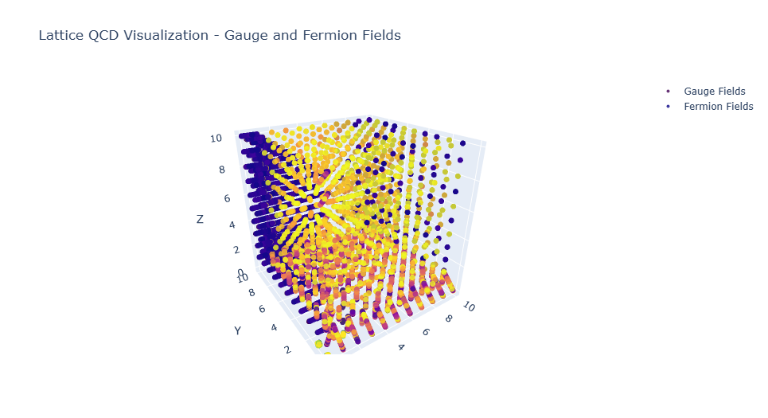
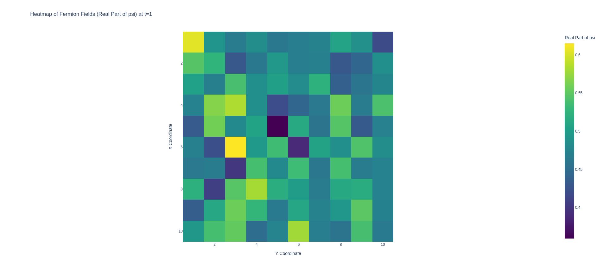

## LQCD Visualization
[](lattice_qcd_evolution_vv.mp4)


---

## Lattice QCD Visualization Tool

---
### Overview

This repository branch contains the script `lqcd_visualization_viv_fin.py` (and `LQCD_Visualization_VIV_fin.ipynb` as well), which provides tools for visualizing and demonstrating the evolution of Lattice Quantum Chromodynamics (LQCD) fields. The script leverages Python's Plotly library to create interactive 3D animations that illustrate the dynamics of fermion and gauge fields on a lattice.

### Key Features

- **3D Animations**: Generates animated 3D plots for both fermion and gauge fields, showing their evolution over time.
- **Interactive Visualization**: Utilizes Plotly's capabilities to create interactive graphics that can be manipulated in the browser, offering different views and deeper insights into the LQCD data.
- **Customizable Output**: Users can adjust the visualization parameters, such as colors, sizes, and animation speed, to suit their specific requirements.
- **HTML Export**: Allows saving the animations as HTML files (`fermion_fields_evolution.html` and `gauge_fields_evolution.html`) for easy sharing and presentation.

1. **Prepare Your Data**: The script requires data in the form of two pandas DataFrames:
   - **Fermion Fields**: A DataFrame with columns: `['x', 'y', 'z', 't', 'i', 'real_psi', 'imag_psi']`.
   - **Gauge Fields**: A DataFrame with columns: `['x', 'y', 'z', 't', 'i', 'j', 'real_U1', 'imag_U1', 'real_U2', 'imag_U2', 'real_U3', 'imag_U3']`.

2. **Run the Script**:
   Execute the script `lqcd_visualization_viv_fin.py` in a Python environment. Make sure to provide the necessary data files or data input mechanism as required by the script.

3. **View Animations**:
   The script will generate two HTML files (`fermion_fields_evolution.html` and `gauge_fields_evolution.html`) containing interactive visualizations. Open these files in any modern web browser to explore the field evolutions.



```python
### PS: Load and read the data in python env:
# Load the fermion field data as a pandas DataFrame
def load_fermion_fields_as_dataframe(filename):
    # Read the file
    with open(filename) as f:
        data = f.read().split()

    # Convert to a NumPy array of floats
    data = np.array(data, dtype=float)

    # Ensure the length of the data is divisible by 7 (fermion data has 7 columns)
    if len(data) % 7 != 0:
        print(f"Warning: Data length ({len(data)}) is not divisible by 7. Truncating excess elements.")
        data = data[:len(data) - (len(data) % 7)]  # Truncate excess data

    # Reshape the data into rows of 7 columns
    data = data.reshape(-1, 7)

    # Create a DataFrame with appropriate column names
    columns = ['x', 'y', 'z', 't', 'i', 'real_psi', 'imag_psi']
    df_fermion = pd.DataFrame(data, columns=columns)

    return df_fermion

# Filename for fermion fields
fermion_field_file = "fermion_fields.txt"

# Load the data as a pandas DataFrame
df_fermion = load_fermion_fields_as_dataframe(fermion_field_file)

