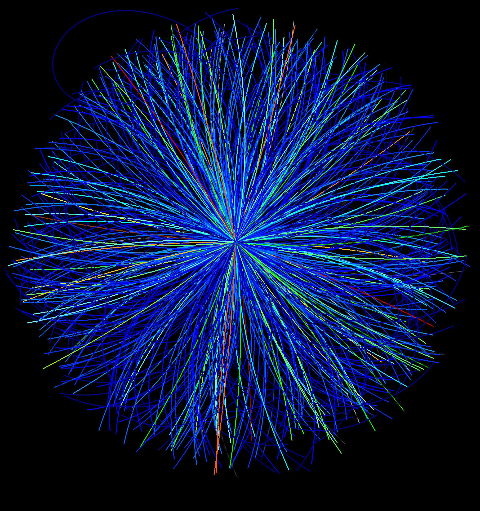
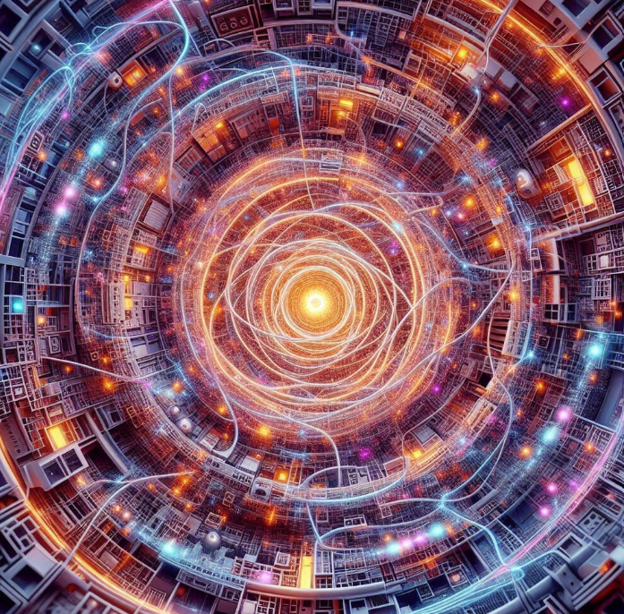

# Simulating QGP from Ultra-Relativistic Proton Collisions

This project focuses on developing a Python-based simulation framework to study the properties and dynamics of Quark Gluon Plasma (QGP) formed in high-energy proton collisions by tools such as for Lattice QCD. This research aims to model and analyze the behavior of quarks and gluons under extreme conditions and in deconfinement stage, providing insights into the fundamental interactions governing the early universe and nuclear matter.

